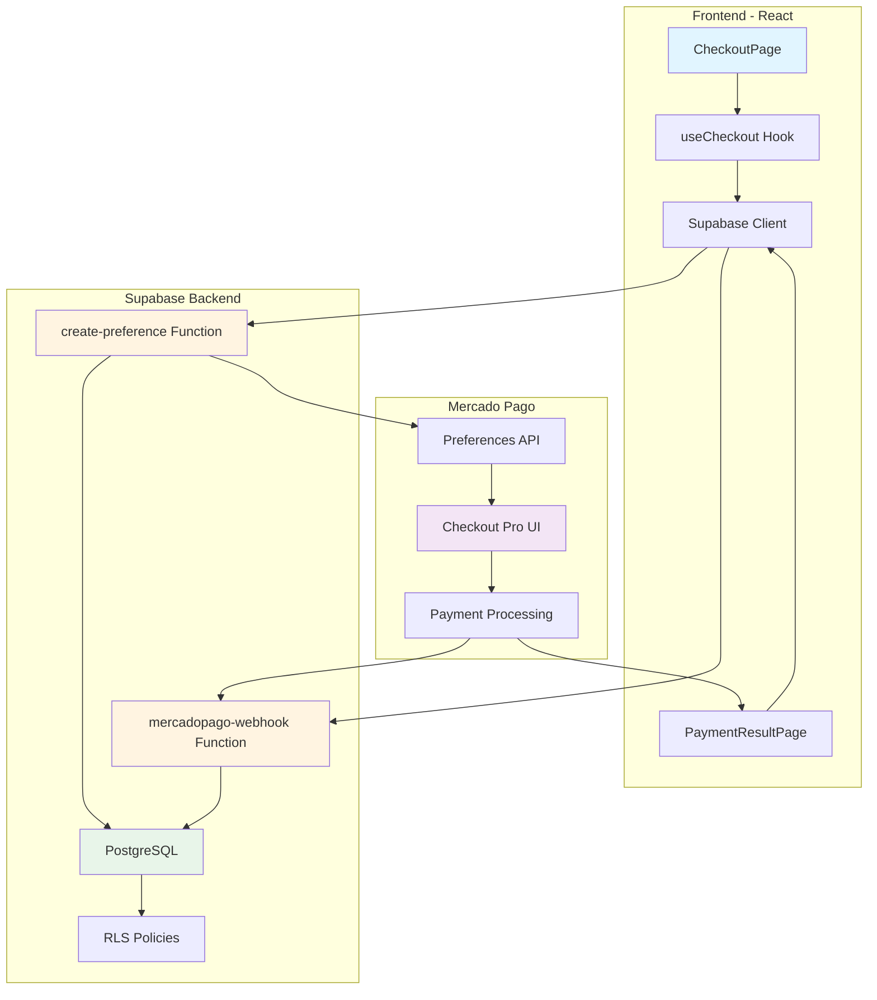
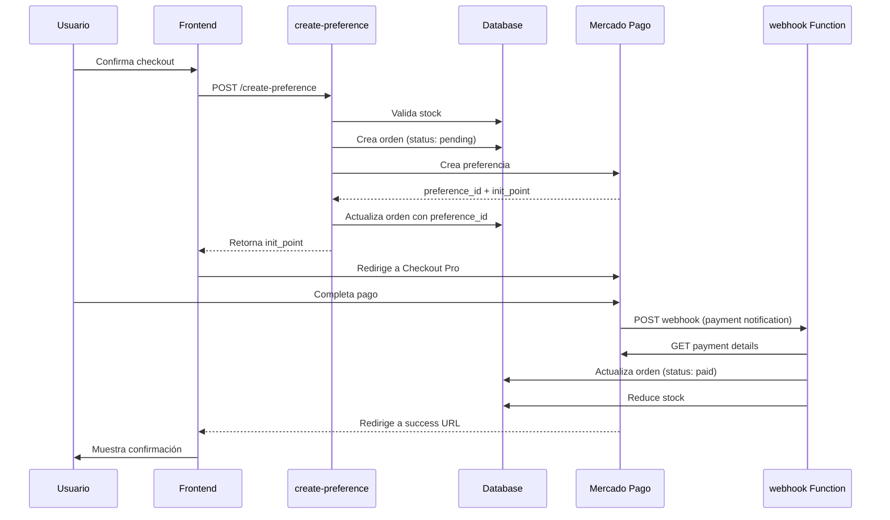

# Diseño Técnico: Integración de Checkout con Mercado Pago

## Overview

Este documento describe el diseño técnico para implementar un sistema completo de checkout con Mercado Pago en la tienda Jireh. La solución utiliza Checkout Pro (redirección) para procesar pagos de forma segura, integrándose con la arquitectura existente de React + TypeScript + Supabase.

### Objetivos del Diseño

- Integrar Mercado Pago Checkout Pro para procesamiento de pagos
- Gestionar el ciclo completo de órdenes desde creación hasta confirmación
- Actualizar inventario automáticamente post-pago
- Procesar webhooks de Mercado Pago de forma segura
- Mantener trazabilidad completa de transacciones
- Garantizar seguridad en validación de datos y montos

### Alcance

El diseño cubre:
- Edge Functions de Supabase para comunicación con Mercado Pago
- Esquema de base de datos para órdenes y transacciones
- Componentes React para flujo de checkout
- Procesamiento de webhooks y actualización de estados
- Gestión de inventario post-pago
- Manejo de errores y logging

### Tecnologías Principales

- **Frontend**: React 18 + TypeScript + Vite
- **Backend**: Supabase (PostgreSQL + Edge Functions)
- **Pagos**: Mercado Pago SDK (Checkout Pro)
- **Autenticación**: Supabase Auth
- **Testing**: Vitest + React Testing Library


## Architecture

### Arquitectura General



### Flujo de Datos Principal



### Principios de Diseño

1. **Seguridad primero**: Todas las validaciones críticas en backend
2. **Idempotencia**: Operaciones de pago y stock son idempotentes
3. **Trazabilidad**: Logging completo de todas las transacciones
4. **Resiliencia**: Reintentos automáticos con backoff exponencial
5. **Separación de responsabilidades**: Edge Functions especializadas


## Components and Interfaces

### Edge Functions

#### 1. create-preference Function

**Responsabilidad**: Crear preferencias de pago y órdenes pendientes

**Ubicación**: `supabase/functions/create-preference/index.ts`

**Input**:
```typescript
interface CreatePreferenceRequest {
  items: Array<{
    variantId: string;
    quantity: number;
    price: number;
    name: string;
    image: string;
  }>;
  totalAmount: number;
  buyerData: {
    name: string;
    email: string;
    phone: string;
    address: {
      street: string;
      number: string;
      zipCode: string;
      city: string;
      state: string;
    };
  };
}
```

**Output**:
```typescript
interface CreatePreferenceResponse {
  orderId: string;
  preferenceId: string;
  initPoint: string;
}
```

**Flujo de Operación**:
1. Autenticar usuario con Supabase Auth
2. Validar que totalAmount coincide con suma de items
3. Validar stock disponible para cada variante
4. Generar número de orden único
5. Crear registro de orden en DB (status: pending)
6. Crear preferencia en Mercado Pago
7. Actualizar orden con preference_id
8. Retornar datos para redirección


#### 2. mercadopago-webhook Function

**Responsabilidad**: Procesar notificaciones de pago de Mercado Pago

**Ubicación**: `supabase/functions/mercadopago-webhook/index.ts`

**Input**:
```typescript
interface WebhookNotification {
  action: string; // "payment.created" | "payment.updated"
  data: {
    id: string; // payment_id
  };
}
```

**Headers Requeridos**:
- `x-signature`: Firma HMAC-SHA256 del webhook
- `x-request-id`: ID único de la petición

**Flujo de Operación**:
1. Validar firma del webhook con access token
2. Extraer payment_id del payload
3. Consultar detalles del pago en API de Mercado Pago
4. Buscar orden por external_reference (order_id)
5. Actualizar estado de orden según payment status:
   - `approved` → `paid` (actualizar paid_at, payment_method)
   - `rejected` → `cancelled`
   - `pending` → mantener `pending`
6. Si status es `approved` y no se ha actualizado stock:
   - Reducir stock de cada variante
   - Marcar orden como stock_updated
7. Registrar transacción en payment_transactions
8. Retornar HTTP 200 (o 400 si falla validación)


### Frontend Components

#### 1. CheckoutPage Component

**Responsabilidad**: Página principal de checkout con formulario de datos

**Ubicación**: `src/pages/CheckoutPage.tsx`

**Estado**:
```typescript
interface CheckoutState {
  cart: CartItem[];
  buyerData: BuyerData;
  isProcessing: boolean;
  error: string | null;
}
```

**Funcionalidades**:
- Mostrar resumen de carrito
- Formulario de datos del comprador (nombre, email, teléfono, dirección)
- Validación de formulario con react-hook-form
- Botón de confirmar compra
- Indicador de carga durante creación de preferencia
- Manejo de errores (stock insuficiente, error de API)

#### 2. useCheckout Hook

**Responsabilidad**: Lógica de negocio para proceso de checkout

**Ubicación**: `src/hooks/useCheckout.ts`

**Interface**:
```typescript
interface UseCheckoutReturn {
  createCheckout: (data: CheckoutData) => Promise<void>;
  isLoading: boolean;
  error: string | null;
}
```

**Funcionalidades**:
- Llamar a create-preference Edge Function
- Manejar redirección a Mercado Pago
- Gestionar estados de carga y error
- Limpiar carrito después de crear preferencia


#### 3. PaymentResultPage Component

**Responsabilidad**: Páginas de resultado de pago (success, failure, pending)

**Ubicación**: `src/pages/PaymentResultPage.tsx`

**Rutas**:
- `/checkout/success?order_id={uuid}` - Pago aprobado
- `/checkout/failure?order_id={uuid}&reason={string}` - Pago rechazado
- `/checkout/pending?order_id={uuid}` - Pago pendiente

**Funcionalidades**:
- Extraer parámetros de URL
- Consultar detalles de orden
- Mostrar mensaje apropiado según resultado
- Botón para ver detalle de orden
- Opción de reintentar pago (en caso de failure)

#### 4. OrderDetailPage Component

**Responsabilidad**: Mostrar detalle completo de una orden

**Ubicación**: `src/pages/OrderDetailPage.tsx`

**Funcionalidades**:
- Consultar orden por ID
- Mostrar items comprados
- Mostrar datos del comprador
- Mostrar estado de pago y envío
- Mostrar método de pago y fecha de pago
- Verificar autorización (solo el comprador puede ver su orden)


### Shared Modules

#### 1. MercadoPagoClient

**Responsabilidad**: Cliente para interactuar con API de Mercado Pago

**Ubicación**: `supabase/functions/_shared/mercadopago-client.ts`

**Métodos**:
```typescript
class MercadoPagoClient {
  constructor(accessToken: string);
  
  // Crear preferencia de pago
  createPreference(preference: MercadoPagoPreference): Promise<PreferenceResponse>;
  
  // Obtener detalles de un pago
  getPayment(paymentId: string): Promise<PaymentDetailsResponse>;
  
  // Validar firma de webhook
  validateWebhookSignature(
    signature: string,
    requestId: string,
    dataId: string
  ): Promise<boolean>;
}
```

**Características**:
- Timeout de 30 segundos en peticiones
- Reintentos automáticos (máximo 2) con backoff exponencial
- Manejo de errores con mensajes descriptivos

#### 2. Utils Module

**Responsabilidad**: Funciones utilitarias compartidas

**Ubicación**: `supabase/functions/_shared/utils.ts`

**Funciones**:
```typescript
// Generar número de orden único (ORD-YYYYMMDD-XXXXX)
function generateOrderNumber(): string;

// Validar que el monto total coincide con items
function validateOrderAmount(
  items: Array<{ quantity: number; unit_price: number }>,
  totalAmount: number
): boolean;

// Traducir errores de Mercado Pago a español
function translateMercadoPagoError(error: string): string;
```


## Data Models

### Database Schema

#### Tabla: orders

```sql
CREATE TABLE orders (
  id UUID PRIMARY KEY DEFAULT gen_random_uuid(),
  order_number TEXT NOT NULL UNIQUE,
  buyer_id UUID NOT NULL REFERENCES auth.users(id),
  preference_id TEXT, -- ID de preferencia de Mercado Pago
  payment_id TEXT, -- ID de pago de Mercado Pago
  
  -- Datos del comprador (JSONB)
  buyer_data JSONB NOT NULL,
  
  -- Items de la orden (JSONB)
  items JSONB NOT NULL,
  
  -- Montos
  total_amount DECIMAL(10, 2) NOT NULL,
  currency TEXT NOT NULL DEFAULT 'CLP',
  
  -- Estados
  status TEXT NOT NULL DEFAULT 'pending',
    -- pending: orden creada, esperando pago
    -- paid: pago aprobado
    -- processing: orden en preparación
    -- shipped: orden enviada
    -- delivered: orden entregada
    -- cancelled: orden cancelada
  
  -- Método de pago
  payment_method TEXT DEFAULT 'checkout_pro',
  
  -- Timestamps
  created_at TIMESTAMPTZ NOT NULL DEFAULT NOW(),
  paid_at TIMESTAMPTZ,
  
  -- Control de actualización de stock
  stock_updated BOOLEAN NOT NULL DEFAULT FALSE,
  
  -- Índices
  CONSTRAINT valid_status CHECK (
    status IN ('pending', 'paid', 'processing', 'shipped', 'delivered', 'cancelled')
  )
);

CREATE INDEX idx_orders_buyer_id ON orders(buyer_id);
CREATE INDEX idx_orders_status ON orders(status);
CREATE INDEX idx_orders_preference_id ON orders(preference_id);
CREATE INDEX idx_orders_payment_id ON orders(payment_id);
CREATE INDEX idx_orders_created_at ON orders(created_at DESC);
```


#### Tabla: payment_transactions

```sql
CREATE TABLE payment_transactions (
  id UUID PRIMARY KEY DEFAULT gen_random_uuid(),
  order_id UUID NOT NULL REFERENCES orders(id),
  payment_id TEXT NOT NULL, -- ID de Mercado Pago
  
  -- Estado del pago
  status TEXT NOT NULL,
    -- approved: pago aprobado
    -- pending: pago pendiente
    -- rejected: pago rechazado
    -- cancelled: pago cancelado
  
  status_detail TEXT, -- Detalle del estado
  
  -- Montos
  amount DECIMAL(10, 2) NOT NULL,
  
  -- Método de pago
  payment_method_id TEXT,
  payment_type_id TEXT,
  
  -- Datos completos de la respuesta de MP (para auditoría)
  response_data JSONB,
  
  -- Timestamp
  created_at TIMESTAMPTZ NOT NULL DEFAULT NOW(),
  
  CONSTRAINT valid_payment_status CHECK (
    status IN ('approved', 'pending', 'rejected', 'cancelled')
  )
);

CREATE INDEX idx_payment_transactions_order_id ON payment_transactions(order_id);
CREATE INDEX idx_payment_transactions_payment_id ON payment_transactions(payment_id);
CREATE INDEX idx_payment_transactions_status ON payment_transactions(status);
```


#### Estructura de JSONB: buyer_data

```json
{
  "name": "Juan Pérez",
  "email": "juan@example.com",
  "phone": "+56912345678",
  "address": {
    "street": "Av. Libertador",
    "number": "1234",
    "zipCode": "8320000",
    "city": "Santiago",
    "state": "Región Metropolitana"
  }
}
```

#### Estructura de JSONB: items

```json
[
  {
    "variant_id": "uuid-variant-1",
    "quantity": 2,
    "unit_price": 15000,
    "name": "Rosa Roja Premium",
    "image": "https://..."
  },
  {
    "variant_id": "uuid-variant-2",
    "quantity": 1,
    "unit_price": 25000,
    "name": "Arreglo Floral Deluxe",
    "image": "https://..."
  }
]
```

### Row Level Security (RLS)

#### Políticas para orders

```sql
-- Los usuarios solo pueden ver sus propias órdenes
CREATE POLICY "Users can view own orders"
ON orders FOR SELECT
TO authenticated
USING (buyer_id = auth.uid());

-- Los usuarios solo pueden crear órdenes para sí mismos
CREATE POLICY "Users can insert own orders"
ON orders FOR INSERT
TO authenticated
WITH CHECK (buyer_id = auth.uid());

-- Solo admins pueden actualizar órdenes
CREATE POLICY "Admins can update orders"
ON orders FOR UPDATE
TO authenticated
USING (
  EXISTS (
    SELECT 1 FROM user_roles
    WHERE user_id = auth.uid() AND role = 'admin'
  )
);
```


#### Políticas para payment_transactions

```sql
-- Los usuarios pueden ver transacciones de sus órdenes
CREATE POLICY "Users can view own payment transactions"
ON payment_transactions FOR SELECT
TO authenticated
USING (
  EXISTS (
    SELECT 1 FROM orders
    WHERE orders.id = payment_transactions.order_id
    AND orders.buyer_id = auth.uid()
  )
);

-- Solo el sistema puede insertar transacciones (via service role)
-- No se requiere política INSERT para usuarios autenticados
```

### Actualización de Inventario

La actualización de stock se realiza en la tabla `product_variants`:

```sql
-- Reducir stock de una variante
UPDATE product_variants
SET stock = stock - :quantity
WHERE id = :variant_id
AND stock >= :quantity; -- Prevenir stock negativo

-- Verificar que la actualización fue exitosa
-- Si affected_rows = 0, significa stock insuficiente
```

**Estrategia de Concurrencia**:
- Usar transacciones SQL para operaciones atómicas
- Constraint CHECK para prevenir stock negativo
- Campo `stock_updated` en orders para idempotencia


## Correctness Properties

*Una propiedad es una característica o comportamiento que debe ser verdadero en todas las ejecuciones válidas de un sistema - esencialmente, una declaración formal sobre lo que el sistema debe hacer. Las propiedades sirven como puente entre las especificaciones legibles por humanos y las garantías de corrección verificables por máquinas.*

### Property 1: Validación de Stock Antes de Checkout

*Para cualquier* carrito de compra, cuando se inicia el checkout, el sistema debe verificar que cada item tenga stock suficiente en la base de datos, y si algún item no tiene stock suficiente, debe rechazar la creación de la preferencia con un mensaje de error indicando los productos sin disponibilidad.

**Validates: Requirements 2.1, 2.2**

### Property 2: Creación Completa de Preferencia

*Para cualquier* checkout válido con stock suficiente, el sistema debe crear una preferencia de Mercado Pago que incluya todos los items del carrito (con nombre, cantidad, precio e imagen), todos los datos del comprador (nombre, email, teléfono, dirección completa), y las tres URLs de retorno (success, failure, pending), retornando un preference_id y un init_point válidos.

**Validates: Requirements 3.1, 3.2, 3.3, 3.4, 3.5**


### Property 3: Estructura Válida de Orden Creada

*Para cualquier* preferencia de pago creada exitosamente, el sistema debe crear una orden en la base de datos con: un UUID válido, un número de orden en formato ORD-YYYYMMDD-XXXXX, el preference_id de Mercado Pago, status inicial "pending", los items del carrito almacenados como JSONB, los datos del comprador almacenados como JSONB, el buyer_id del usuario autenticado, y el monto total que coincide con la suma de (cantidad × precio) de todos los items.

**Validates: Requirements 4.1, 4.2, 4.3, 4.4, 4.5, 4.6, 4.7, 4.8, 4.9**

### Property 4: Extracción de Parámetros de URL de Retorno

*Para cualquier* URL de retorno de Mercado Pago que contenga parámetros (payment_id, status, external_reference), el sistema debe extraer correctamente todos los parámetros presentes.

**Validates: Requirements 6.2**

### Property 5: Validación de Firma de Webhook

*Para cualquier* webhook recibido de Mercado Pago, el sistema debe validar la autenticidad usando la firma HMAC-SHA256 del header x-signature, aceptando webhooks con firma válida y rechazando webhooks con firma inválida o ausente con HTTP 400.

**Validates: Requirements 7.2, 7.10**


### Property 6: Actualización de Estado de Orden por Payment Status

*Para cualquier* webhook válido con un payment_id, el sistema debe consultar el estado del pago en Mercado Pago y actualizar el estado de la orden correspondiente según el payment status: "approved" → "paid", "rejected" → "cancelled", "pending" → mantener "pending".

**Validates: Requirements 7.4**

### Property 7: Datos Completos de Pago Aprobado

*Para cualquier* orden que cambia a estado "paid", el sistema debe registrar la fecha de pago (paid_at), el método de pago utilizado (payment_method), y el payment_id de Mercado Pago.

**Validates: Requirements 7.7, 7.8, 7.9**

### Property 8: Reducción Exacta de Inventario

*Para cualquier* orden que cambia a estado "paid", el sistema debe reducir el stock de cada variante en la cantidad exacta especificada en los items de la orden, y esta reducción debe ocurrir exactamente una vez incluso si se reciben múltiples webhooks para la misma orden (idempotencia).

**Validates: Requirements 8.1, 8.2, 8.5**


### Property 9: Consulta de Órdenes por Buyer

*Para cualquier* buyer autenticado que solicita sus órdenes, el sistema debe retornar todas y solo las órdenes asociadas a su buyer_id, ordenadas por fecha de creación descendente, e incluyendo para cada orden: número de orden, monto total, estado y fecha de creación.

**Validates: Requirements 9.1, 9.2, 9.3, 9.4**

### Property 10: Completitud de Detalle de Orden

*Para cualquier* orden consultada por su dueño autenticado, el sistema debe retornar información completa incluyendo: datos del comprador (nombre, email, dirección), todos los items con sus datos (nombre, cantidad, precio, imagen), el estado actual, la fecha de creación, y si la orden está pagada, el método de pago y fecha de pago.

**Validates: Requirements 10.1, 10.2, 10.3, 10.4, 10.5**

### Property 11: Autorización de Acceso a Órdenes

*Para cualquier* orden en el sistema, solo el buyer que la creó (buyer_id = auth.uid()) debe poder consultar sus detalles, y cualquier intento de acceso por otro usuario debe ser rechazado por las políticas RLS.

**Validates: Requirements 10.6, 12.4**


### Property 12: Orden Permanece Pending en Pago Fallido

*Para cualquier* orden cuyo pago es rechazado por Mercado Pago, el sistema debe cambiar el estado a "cancelled" (no mantener "pending"), permitiendo distinguir entre órdenes esperando pago y órdenes con pago fallido.

**Validates: Requirements 11.4**

### Property 13: Validación de Monto Total

*Para cualquier* solicitud de creación de preferencia, el sistema debe validar que el monto total enviado desde el frontend coincide exactamente con el monto calculado en el backend sumando (cantidad × precio) de todos los items, rechazando la solicitud si hay discrepancia.

**Validates: Requirements 12.1**

### Property 14: Validación de Precios contra Base de Datos

*Para cualquier* solicitud de creación de preferencia, el sistema debe validar que todos los precios de los items coinciden con los precios almacenados en la base de datos para las variantes correspondientes, rechazando la solicitud si algún precio fue manipulado.

**Validates: Requirements 12.2**


## Error Handling

### Categorías de Errores

#### 1. Errores de Validación (HTTP 400)

**Stock Insuficiente**:
```typescript
{
  error: "INSUFFICIENT_STOCK",
  message: "Algunos productos no tienen stock suficiente",
  details: [
    {
      variantId: "uuid",
      productName: "Rosa Roja Premium",
      requested: 5,
      available: 2
    }
  ]
}
```

**Monto Inválido**:
```typescript
{
  error: "INVALID_AMOUNT",
  message: "El monto total no coincide con los items del carrito",
  expected: 45000,
  received: 40000
}
```

**Precio Manipulado**:
```typescript
{
  error: "INVALID_PRICE",
  message: "Los precios de los items no coinciden con la base de datos",
  details: [
    {
      variantId: "uuid",
      expectedPrice: 15000,
      receivedPrice: 10000
    }
  ]
}
```


#### 2. Errores de Autenticación (HTTP 401)

**Usuario No Autenticado**:
```typescript
{
  error: "UNAUTHORIZED",
  message: "Debes iniciar sesión para realizar una compra"
}
```

#### 3. Errores de Autorización (HTTP 403)

**Acceso a Orden de Otro Usuario**:
```typescript
{
  error: "FORBIDDEN",
  message: "No tienes permiso para acceder a esta orden"
}
```

#### 4. Errores de Mercado Pago (HTTP 400/500)

**Error de API**:
```typescript
{
  error: "PAYMENT_GATEWAY_ERROR",
  message: "Error al comunicarse con Mercado Pago",
  details: "Request timeout" // o mensaje de MP
}
```

**Webhook Inválido**:
```typescript
{
  error: "INVALID_WEBHOOK",
  message: "La firma del webhook no es válida"
}
```


#### 5. Errores de Base de Datos (HTTP 500)

**Error de Inserción**:
```typescript
{
  error: "DATABASE_ERROR",
  message: "Error al crear la orden",
  details: "Constraint violation" // solo en desarrollo
}
```

### Estrategia de Manejo de Errores

#### En Edge Functions

1. **Try-Catch Global**: Envolver toda la lógica en try-catch
2. **Logging Detallado**: Registrar stack trace completo en logs
3. **Respuestas Consistentes**: Siempre retornar JSON con estructura de error
4. **Códigos HTTP Apropiados**: 400 (validación), 401 (auth), 403 (authz), 500 (server)
5. **Mensajes en Español**: Traducir errores de Mercado Pago

#### En Frontend

1. **Toast Notifications**: Mostrar errores con react-hot-toast
2. **Mensajes Amigables**: Traducir códigos de error a mensajes legibles
3. **Acciones de Recuperación**: Ofrecer botones para reintentar o volver
4. **Preservar Estado**: Mantener datos del formulario en caso de error
5. **Loading States**: Deshabilitar botones durante operaciones


### Reintentos y Resiliencia

#### MercadoPagoClient

- **Timeout**: 30 segundos por petición
- **Reintentos**: Máximo 2 reintentos automáticos
- **Backoff**: Exponencial (1s, 2s)
- **Errores Reintentables**: Timeout, 5xx de Mercado Pago
- **Errores No Reintentables**: 4xx (validación, auth)

#### Webhooks

- **Idempotencia**: Usar `stock_updated` flag para evitar duplicación
- **Reintentos de MP**: Mercado Pago reintenta webhooks automáticamente
- **Validación Primero**: Validar firma antes de procesar
- **Respuesta Rápida**: Retornar 200 lo antes posible


## Testing Strategy

### Enfoque Dual de Testing

Este proyecto utiliza un enfoque dual que combina:

1. **Unit Tests**: Para casos específicos, ejemplos concretos y edge cases
2. **Property-Based Tests**: Para propiedades universales que deben cumplirse con cualquier entrada

Ambos tipos de tests son complementarios y necesarios:
- Los unit tests capturan bugs concretos y validan comportamientos específicos
- Los property tests verifican corrección general a través de múltiples inputs aleatorios

### Property-Based Testing

#### Librería: fast-check

Utilizaremos `fast-check` para TypeScript, que permite:
- Generación automática de inputs aleatorios
- Shrinking automático para encontrar casos mínimos de falla
- Configuración de número de iteraciones

#### Configuración

Cada property test debe:
- Ejecutar mínimo 100 iteraciones (debido a randomización)
- Incluir un comentario con tag: `Feature: mercadopago-checkout-integration, Property {N}: {descripción}`
- Referenciar la propiedad del documento de diseño


#### Ejemplo de Property Test

```typescript
import fc from 'fast-check';
import { describe, it, expect } from 'vitest';

// Feature: mercadopago-checkout-integration, Property 3: Estructura Válida de Orden Creada
describe('Property 3: Estructura Válida de Orden Creada', () => {
  it('toda orden creada debe tener estructura válida', async () => {
    await fc.assert(
      fc.asyncProperty(
        fc.record({
          items: fc.array(fc.record({
            variantId: fc.uuid(),
            quantity: fc.integer({ min: 1, max: 10 }),
            price: fc.integer({ min: 1000, max: 100000 }),
            name: fc.string({ minLength: 1 }),
            image: fc.webUrl()
          }), { minLength: 1 }),
          buyerData: fc.record({
            name: fc.string({ minLength: 1 }),
            email: fc.emailAddress(),
            phone: fc.string({ minLength: 8 }),
            address: fc.record({
              street: fc.string({ minLength: 1 }),
              number: fc.string({ minLength: 1 }),
              zipCode: fc.string({ minLength: 4 }),
              city: fc.string({ minLength: 1 }),
              state: fc.string({ minLength: 1 })
            })
          })
        }),
        async (checkoutData) => {
          const totalAmount = checkoutData.items.reduce(
            (sum, item) => sum + item.quantity * item.price, 0
          );
          
          const response = await createPreference({
            ...checkoutData,
            totalAmount
          });
          
          expect(response.orderId).toMatch(/^[0-9a-f-]{36}$/); // UUID
          expect(response.orderNumber).toMatch(/^ORD-\d{8}-\d{5}$/);
          
          const order = await getOrderById(response.orderId);
          expect(order.status).toBe('pending');
          expect(order.buyer_id).toBe(currentUser.id);
          expect(order.preference_id).toBe(response.preferenceId);
          expect(order.total_amount).toBe(totalAmount);
          expect(order.items).toHaveLength(checkoutData.items.length);
        }
      ),
      { numRuns: 100 }
    );
  });
});
```


### Unit Testing

#### Casos a Cubrir con Unit Tests

**Edge Functions**:
- Creación de preferencia con datos válidos
- Rechazo por stock insuficiente
- Rechazo por monto inválido
- Rechazo por precio manipulado
- Rechazo por usuario no autenticado
- Procesamiento de webhook con firma válida
- Rechazo de webhook con firma inválida
- Actualización de orden a "paid" cuando payment status es "approved"
- Actualización de orden a "cancelled" cuando payment status es "rejected"
- Reducción de stock después de pago aprobado
- Idempotencia de actualización de stock (múltiples webhooks)

**Frontend Components**:
- Renderizado de CheckoutPage con carrito
- Validación de formulario de datos del comprador
- Llamada a create-preference al confirmar
- Mostrar error cuando stock es insuficiente
- Redirección a Mercado Pago con init_point
- Renderizado de PaymentResultPage con orden exitosa
- Renderizado de PaymentResultPage con orden fallida
- Consulta de detalle de orden
- Autorización de acceso a orden (solo dueño)


**Shared Modules**:
- MercadoPagoClient.createPreference con datos válidos
- MercadoPagoClient.getPayment con payment_id válido
- MercadoPagoClient.validateWebhookSignature con firma válida/inválida
- MercadoPagoClient timeout después de 30 segundos
- MercadoPagoClient reintentos con backoff exponencial
- generateOrderNumber genera formato correcto
- validateOrderAmount valida correctamente
- translateMercadoPagoError traduce errores comunes

### Mocking y Test Doubles

#### Mercado Pago API

Usar mocks para simular respuestas de Mercado Pago:

```typescript
// Mock de createPreference
vi.mock('../_shared/mercadopago-client', () => ({
  MercadoPagoClient: vi.fn().mockImplementation(() => ({
    createPreference: vi.fn().mockResolvedValue({
      id: 'test-preference-id',
      init_point: 'https://www.mercadopago.cl/checkout/v1/redirect?pref_id=test'
    }),
    getPayment: vi.fn().mockResolvedValue({
      id: 'test-payment-id',
      status: 'approved',
      status_detail: 'accredited',
      transaction_amount: 45000,
      payment_method_id: 'visa',
      payment_type_id: 'credit_card',
      external_reference: 'test-order-id'
    }),
    validateWebhookSignature: vi.fn().mockResolvedValue(true)
  }))
}));
```


#### Supabase Client

Usar Supabase local para tests de integración:

```typescript
import { createClient } from '@supabase/supabase-js';

const supabaseTest = createClient(
  'http://localhost:54321',
  'test-anon-key'
);
```

### Cobertura de Testing

**Objetivo de Cobertura**:
- Edge Functions: 90%+ de cobertura de líneas
- Frontend Components: 80%+ de cobertura de líneas
- Shared Modules: 95%+ de cobertura de líneas

**Métricas a Monitorear**:
- Número de property tests ejecutados
- Número de iteraciones por property test
- Casos de shrinking encontrados
- Tiempo de ejecución de tests
- Cobertura de código

### Integración Continua

**Pipeline de CI**:
1. Ejecutar linter (ESLint)
2. Ejecutar type checker (TypeScript)
3. Ejecutar unit tests
4. Ejecutar property tests
5. Generar reporte de cobertura
6. Fallar build si cobertura < objetivo

**Comandos**:
```bash
# Ejecutar todos los tests
npm test

# Ejecutar solo property tests
npm test -- --grep "Property"

# Ejecutar con cobertura
npm test -- --coverage

# Ejecutar en modo watch
npm test -- --watch
```

