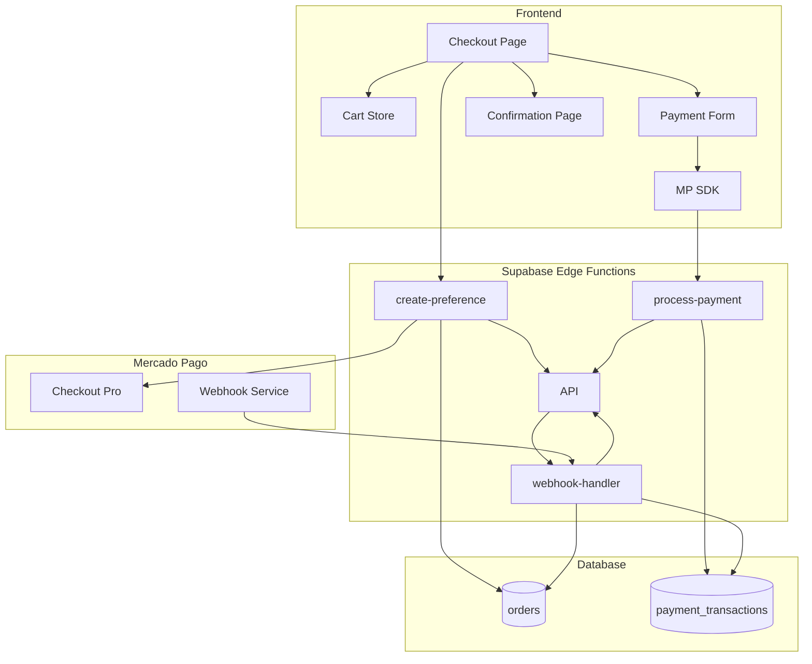
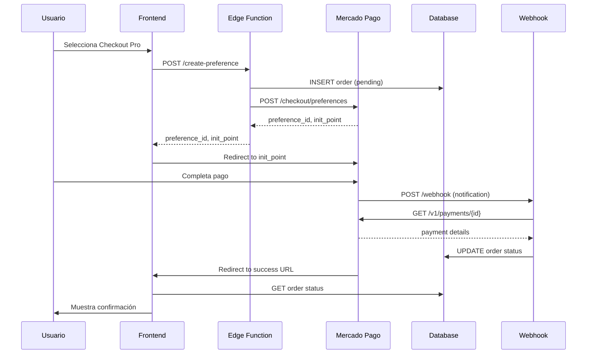
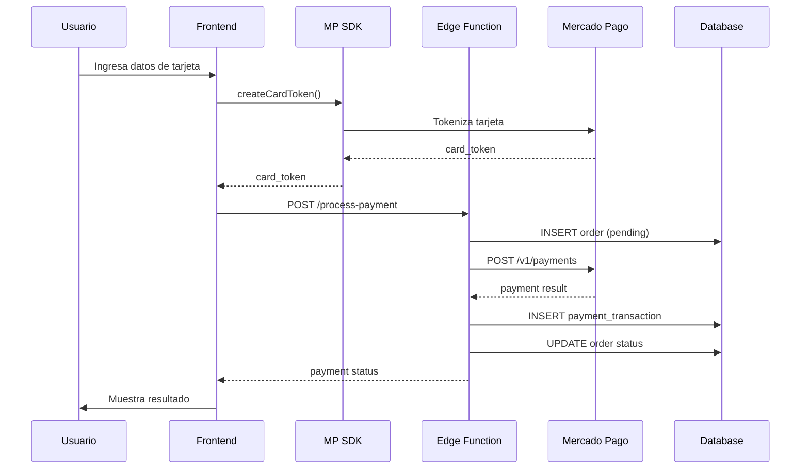

# Diseño Técnico: Integración de Pagos con Mercado Pago

## Overview

Este diseño especifica la arquitectura e implementación de un sistema completo de procesamiento de pagos con Mercado Pago para un e-commerce operando en Chile. El sistema soporta dos métodos de integración:

- **Checkout Pro**: Redirección a la página de pago de Mercado Pago
- **Checkout API**: Formulario de pago embebido con tokenización de tarjetas

La arquitectura utiliza:
- **Frontend**: React/TypeScript con Zustand para gestión de estado
- **Backend**: Supabase Edge Functions (Deno runtime)
- **Base de datos**: PostgreSQL (Supabase)
- **SDK**: Mercado Pago JavaScript SDK v2
- **Moneda**: CLP (Peso Chileno)

El flujo general incluye:
1. Usuario agrega productos al carrito (Cart Store)
2. Usuario procede al checkout y selecciona método de pago
3. Sistema crea orden y procesa pago según método elegido
4. Mercado Pago envía notificaciones vía webhook
5. Sistema actualiza estado de orden y muestra confirmación

## Architecture

### Componentes Principales



### Flujo de Checkout Pro



### Flujo de Checkout API



## Components and Interfaces

### Frontend Components

#### CheckoutPage Component
```typescript
interface CheckoutPageProps {
  // No props, lee del Cart Store
}

interface CheckoutState {
  paymentMethod: 'checkout_pro' | 'checkout_api' | null;
  buyerData: BuyerData;
  isProcessing: boolean;
  error: string | null;
}

interface BuyerData {
  email: string;
  name: string;
  phone: string;
  address: {
    street: string;
    number: string;
    city: string;
    state: string;
    zipCode: string;
  };
}
```

#### CardForm Component (Checkout API)
```typescript
interface CardFormProps {
  onSubmit: (token: string) => Promise<void>;
  isProcessing: boolean;
}

// Usa el componente CardForm del SDK de Mercado Pago
// Configuración:
const cardForm = mp.cardForm({
  amount: string;
  iframe: boolean;
  form: {
    id: string;
    cardNumber: { id: string; placeholder: string };
    expirationDate: { id: string; placeholder: string };
    securityCode: { id: string; placeholder: string };
    cardholderName: { id: string; placeholder: string };
    issuer: { id: string; placeholder: string };
    installments: { id: string; placeholder: string };
    identificationType: { id: string; placeholder: string };
    identificationNumber: { id: string; placeholder: string };
    cardholderEmail: { id: string; placeholder: string };
  };
  callbacks: {
    onFormMounted: (error: any) => void;
    onSubmit: (event: Event) => Promise<void>;
    onFetching: (resource: string) => void;
  };
});
```

#### CheckoutProButton Component
```typescript
interface CheckoutProButtonProps {
  buyerData: BuyerData;
  cartItems: CartItem[];
  onSuccess: (preferenceId: string) => void;
  onError: (error: Error) => void;
}
```

#### ConfirmationPage Component
```typescript
interface ConfirmationPageProps {
  orderId: string; // De URL params
  paymentId?: string; // De URL params (Checkout Pro)
}

interface OrderDetails {
  orderNumber: string;
  status: OrderStatus;
  items: OrderItem[];
  totalAmount: number;
  paymentMethod: string;
  buyerData: BuyerData;
  createdAt: string;
  paidAt?: string;
}
```

### Cart Store (Zustand)

```typescript
interface CartItem {
  id: string;
  name: string;
  price: number;
  quantity: number;
  imageUrl?: string;
}

interface CartStore {
  items: CartItem[];
  addItem: (item: CartItem) => void;
  removeItem: (itemId: string) => void;
  updateQuantity: (itemId: string, quantity: number) => void;
  clearCart: () => void;
  getTotalAmount: () => number;
  getTotalItems: () => number;
}
```

### Edge Functions

#### create-preference Function
```typescript
// POST /functions/v1/create-preference
interface CreatePreferenceRequest {
  items: Array<{
    id: string;
    title: string;
    quantity: number;
    unit_price: number;
  }>;
  payer: {
    name: string;
    email: string;
    phone: {
      area_code: string;
      number: string;
    };
    address: {
      street_name: string;
      street_number: string;
      zip_code: string;
    };
  };
}

interface CreatePreferenceResponse {
  preferenceId: string;
  initPoint: string;
  orderId: string;
  orderNumber: string;
}

interface MercadoPagoPreference {
  items: Array<{
    id: string;
    title: string;
    quantity: number;
    unit_price: number;
    currency_id: 'CLP';
  }>;
  payer: {
    name: string;
    email: string;
    phone: {
      area_code: string;
      number: string;
    };
    address: {
      street_name: string;
      street_number: string;
      zip_code: string;
    };
  };
  back_urls: {
    success: string;
    failure: string;
    pending: string;
  };
  auto_return: 'approved';
  notification_url: string;
  statement_descriptor: string;
  external_reference: string; // order_number
}
```

#### process-payment Function
```typescript
// POST /functions/v1/process-payment
interface ProcessPaymentRequest {
  token: string; // card_token del SDK
  items: Array<{
    id: string;
    title: string;
    quantity: number;
    unit_price: number;
  }>;
  payer: {
    email: string;
    identification: {
      type: string;
      number: string;
    };
  };
  installments: number;
  issuerId: string;
  paymentMethodId: string;
}

interface ProcessPaymentResponse {
  paymentId: string;
  status: PaymentStatus;
  statusDetail: string;
  orderId: string;
  orderNumber: string;
}

interface MercadoPagoPayment {
  token: string;
  transaction_amount: number;
  installments: number;
  payment_method_id: string;
  issuer_id: string;
  payer: {
    email: string;
    identification: {
      type: string;
      number: string;
    };
  };
  description: string;
  external_reference: string; // order_number
  notification_url: string;
  statement_descriptor: string;
}
```

#### webhook-handler Function
```typescript
// POST /functions/v1/webhook-handler
interface WebhookNotification {
  id: string;
  live_mode: boolean;
  type: 'payment' | 'plan' | 'subscription' | 'invoice' | 'point_integration_wh';
  date_created: string;
  application_id: string;
  user_id: string;
  version: string;
  api_version: string;
  action: 'payment.created' | 'payment.updated';
  data: {
    id: string; // payment_id
  };
}

interface WebhookHeaders {
  'x-signature': string;
  'x-request-id': string;
}

// Validación de firma
interface SignatureValidation {
  isValid: boolean;
  timestamp: number;
  signature: string;
}
```

### Mercado Pago API Client

```typescript
class MercadoPagoClient {
  private accessToken: string;
  private baseUrl: string = 'https://api.mercadopago.com';
  
  constructor(accessToken: string) {
    this.accessToken = accessToken;
  }
  
  async createPreference(preference: MercadoPagoPreference): Promise<{
    id: string;
    init_point: string;
  }>;
  
  async createPayment(payment: MercadoPagoPayment): Promise<{
    id: string;
    status: PaymentStatus;
    status_detail: string;
    payment_method_id: string;
    payment_type_id: string;
  }>;
  
  async getPayment(paymentId: string): Promise<{
    id: string;
    status: PaymentStatus;
    status_detail: string;
    transaction_amount: number;
    payment_method_id: string;
    payment_type_id: string;
    external_reference: string;
  }>;
  
  validateWebhookSignature(
    signature: string,
    requestId: string,
    dataId: string
  ): boolean;
}
```

### Utility Functions

```typescript
// Validación de montos
function validateOrderAmount(
  items: CartItem[],
  expectedTotal: number
): { isValid: boolean; calculatedTotal: number };

// Generación de order_number
function generateOrderNumber(): string; // Format: ORD-YYYYMMDD-XXXXX

// Traducción de errores
function translateMercadoPagoError(
  errorCode: string,
  statusDetail: string
): string;

// Validación de datos del comprador
function validateBuyerData(data: BuyerData): {
  isValid: boolean;
  errors: Record<string, string>;
};

// Formateo de moneda
function formatCurrency(amount: number): string; // $1.234 CLP
```

## Data Models

### Database Schema

#### orders Table
```sql
CREATE TABLE orders (
  id UUID PRIMARY KEY DEFAULT uuid_generate_v4(),
  order_number VARCHAR(50) UNIQUE NOT NULL,
  buyer_id UUID NOT NULL REFERENCES auth.users(id),
  items JSONB NOT NULL,
  total_amount DECIMAL(10, 2) NOT NULL,
  currency VARCHAR(3) NOT NULL DEFAULT 'CLP',
  status VARCHAR(20) NOT NULL DEFAULT 'pending',
  payment_method VARCHAR(20),
  preference_id VARCHAR(100),
  buyer_data JSONB NOT NULL,
  created_at TIMESTAMPTZ NOT NULL DEFAULT NOW(),
  updated_at TIMESTAMPTZ NOT NULL DEFAULT NOW(),
  paid_at TIMESTAMPTZ,
  
  CONSTRAINT valid_status CHECK (
    status IN ('pending', 'paid', 'failed', 'cancelled')
  ),
  CONSTRAINT valid_payment_method CHECK (
    payment_method IN ('checkout_pro', 'checkout_api') OR payment_method IS NULL
  ),
  CONSTRAINT positive_amount CHECK (total_amount > 0)
);

CREATE INDEX idx_orders_order_number ON orders(order_number);
CREATE INDEX idx_orders_buyer_id ON orders(buyer_id);
CREATE INDEX idx_orders_status ON orders(status);
CREATE INDEX idx_orders_created_at ON orders(created_at DESC);
```

#### payment_transactions Table
```sql
CREATE TABLE payment_transactions (
  id UUID PRIMARY KEY DEFAULT uuid_generate_v4(),
  order_id UUID NOT NULL REFERENCES orders(id) ON DELETE CASCADE,
  payment_id VARCHAR(100) UNIQUE NOT NULL,
  status VARCHAR(20) NOT NULL,
  amount DECIMAL(10, 2) NOT NULL,
  payment_method_id VARCHAR(50),
  payment_type_id VARCHAR(50),
  status_detail VARCHAR(100),
  response_data JSONB NOT NULL,
  created_at TIMESTAMPTZ NOT NULL DEFAULT NOW(),
  updated_at TIMESTAMPTZ NOT NULL DEFAULT NOW(),
  
  CONSTRAINT valid_payment_status CHECK (
    status IN ('pending', 'approved', 'rejected', 'cancelled', 'in_process', 'refunded')
  )
);

CREATE INDEX idx_payment_transactions_order_id ON payment_transactions(order_id);
CREATE INDEX idx_payment_transactions_payment_id ON payment_transactions(payment_id);
CREATE INDEX idx_payment_transactions_status ON payment_transactions(status);
```

#### order_status_history Table (Opcional, para auditoría)
```sql
CREATE TABLE order_status_history (
  id UUID PRIMARY KEY DEFAULT uuid_generate_v4(),
  order_id UUID NOT NULL REFERENCES orders(id) ON DELETE CASCADE,
  previous_status VARCHAR(20),
  new_status VARCHAR(20) NOT NULL,
  changed_by VARCHAR(50), -- 'system', 'webhook', 'admin'
  metadata JSONB,
  created_at TIMESTAMPTZ NOT NULL DEFAULT NOW()
);

CREATE INDEX idx_order_status_history_order_id ON order_status_history(order_id);
```

### TypeScript Types

```typescript
type OrderStatus = 'pending' | 'paid' | 'failed' | 'cancelled';

type PaymentStatus = 
  | 'pending' 
  | 'approved' 
  | 'rejected' 
  | 'cancelled' 
  | 'in_process' 
  | 'refunded';

type PaymentMethod = 'checkout_pro' | 'checkout_api';

interface Order {
  id: string;
  orderNumber: string;
  buyerId: string;
  items: OrderItem[];
  totalAmount: number;
  currency: string;
  status: OrderStatus;
  paymentMethod?: PaymentMethod;
  preferenceId?: string;
  buyerData: BuyerData;
  createdAt: string;
  updatedAt: string;
  paidAt?: string;
}

interface OrderItem {
  id: string;
  title: string;
  quantity: number;
  unitPrice: number;
}

interface PaymentTransaction {
  id: string;
  orderId: string;
  paymentId: string;
  status: PaymentStatus;
  amount: number;
  paymentMethodId?: string;
  paymentTypeId?: string;
  statusDetail?: string;
  responseData: Record<string, any>;
  createdAt: string;
  updatedAt: string;
}
```

### Row Level Security Policies

```sql
-- Habilitar RLS
ALTER TABLE orders ENABLE ROW LEVEL SECURITY;
ALTER TABLE payment_transactions ENABLE ROW LEVEL SECURITY;
ALTER TABLE order_status_history ENABLE ROW LEVEL SECURITY;

-- Políticas para orders
CREATE POLICY "Users can view their own orders"
  ON orders FOR SELECT
  USING (auth.uid() = buyer_id);

CREATE POLICY "Users can create orders for themselves"
  ON orders FOR INSERT
  WITH CHECK (auth.uid() = buyer_id);

CREATE POLICY "Service role can do everything on orders"
  ON orders FOR ALL
  USING (auth.jwt()->>'role' = 'service_role');

-- Políticas para payment_transactions
CREATE POLICY "Users can view transactions of their orders"
  ON payment_transactions FOR SELECT
  USING (
    EXISTS (
      SELECT 1 FROM orders
      WHERE orders.id = payment_transactions.order_id
      AND orders.buyer_id = auth.uid()
    )
  );

CREATE POLICY "Service role can do everything on payment_transactions"
  ON payment_transactions FOR ALL
  USING (auth.jwt()->>'role' = 'service_role');

-- Políticas para order_status_history
CREATE POLICY "Users can view history of their orders"
  ON order_status_history FOR SELECT
  USING (
    EXISTS (
      SELECT 1 FROM orders
      WHERE orders.id = order_status_history.order_id
      AND orders.buyer_id = auth.uid()
    )
  );

CREATE POLICY "Service role can do everything on order_status_history"
  ON order_status_history FOR ALL
  USING (auth.jwt()->>'role' = 'service_role');
```

### Environment Variables

```typescript
interface EnvironmentConfig {
  // Mercado Pago
  MERCADOPAGO_ACCESS_TOKEN: string;
  MERCADOPAGO_PUBLIC_KEY: string;
  MERCADOPAGO_WEBHOOK_SECRET?: string;
  
  // URLs
  FRONTEND_URL: string;
  WEBHOOK_URL: string;
  
  // Supabase
  SUPABASE_URL: string;
  SUPABASE_ANON_KEY: string;
  SUPABASE_SERVICE_ROLE_KEY: string;
  
  // Configuración
  ENVIRONMENT: 'test' | 'production';
  STATEMENT_DESCRIPTOR: string; // Aparece en el estado de cuenta
}
```


## Correctness Properties

*A property is a characteristic or behavior that should hold true across all valid executions of a system-essentially, a formal statement about what the system should do. Properties serve as the bridge between human-readable specifications and machine-verifiable correctness guarantees.*

### Property 1: Order Creation with Pending Status

*For any* valid buyer and cart items, when creating an order for Checkout Pro or Checkout API, the system should create an order with status "pending" and a unique order_number.

**Validates: Requirements 1.1, 4.1, 4.3**

### Property 2: Payment Preference Contains Cart Items

*For any* set of cart items, when creating a payment preference, the preference should contain exactly those items with matching titles, quantities, and prices.

**Validates: Requirements 1.2**

### Property 3: Payment Preference Structure Completeness

*For any* payment preference created, it should include all required fields: back_urls (success, failure, pending), payer information (email, name, phone), and preference_id.

**Validates: Requirements 1.3, 1.4, 1.5**

### Property 4: Preference ID Persistence

*For any* order created via Checkout Pro, the preference_id returned by Mercado Pago should be stored in the order record.

**Validates: Requirements 1.7**

### Property 5: Error Messages on Failure

*For any* failed operation (preference creation, payment processing, webhook validation), the system should return a descriptive error message without exposing sensitive technical details.

**Validates: Requirements 1.6, 2.7, 12.1, 12.4**

### Property 6: Card Token Generation and Transmission

*For any* valid card data, the system should generate a payment token using the SDK and transmit it to the Edge Function along with order data, never storing raw card data.

**Validates: Requirements 2.3, 2.4, 2.8**

### Property 7: Payment Processing Response Structure

*For any* payment processed (successful or failed), the Edge Function should return both payment_status and payment_id in the response.

**Validates: Requirements 2.6**

### Property 8: Webhook Signature Validation

*For any* webhook notification received, the system should validate the x-signature header, returning HTTP 401 for invalid signatures and HTTP 200 for valid ones after processing.

**Validates: Requirements 3.2, 3.7, 3.8**

### Property 9: Webhook Idempotency

*For any* webhook notification, processing it multiple times should produce the same final state (same order status, same transaction record) as processing it once.

**Validates: Requirements 3.9**

### Property 10: Payment Status to Order Status Mapping

*For any* payment status update received via webhook, the system should map payment statuses to order statuses correctly: "approved" → "paid", "rejected" → "failed".

**Validates: Requirements 3.5, 3.6**

### Property 11: Webhook Payment Query

*For any* webhook notification of type "payment", the system should query the Mercado Pago API for the current payment status and update both the payment_transaction and order records.

**Validates: Requirements 3.3, 3.4**

### Property 12: Order Structure Completeness

*For any* order created, it should include all required fields: buyer_id, items, total_amount, currency, and timestamp.

**Validates: Requirements 4.2**

### Property 13: Valid State Transitions

*For any* order, the system should allow only valid state transitions (pending → paid, pending → failed, pending → cancelled) and reject invalid ones (paid → pending, paid → failed).

**Validates: Requirements 4.4, 4.5**

### Property 14: Payment Date Recording

*For any* order transitioning to "paid" status, the system should record the payment_date timestamp at the moment of transition.

**Validates: Requirements 4.6**

### Property 15: State Change History

*For any* order status change, the system should create a history record with previous status, new status, timestamp, and change source.

**Validates: Requirements 4.7**

### Property 16: Payment Transaction Creation

*For any* payment processed, the system should create a payment_transaction record containing payment_id, order_id, amount, status, payment_method_id, payment_type_id, and the complete Mercado Pago response as JSON.

**Validates: Requirements 5.1, 5.2, 5.3, 5.5**

### Property 17: Transaction-Order Relationship

*For any* payment_transaction, it should be related to exactly one order via the order_id foreign key.

**Validates: Requirements 5.6**

### Property 18: Transaction Updates from Webhook

*For any* webhook notification for an existing payment, the system should update the corresponding payment_transaction record with the new status and response data.

**Validates: Requirements 5.4**

### Property 19: Buyer Data Validation

*For any* buyer data submitted, the system should validate email format (RFC 5322) and phone format before allowing checkout to proceed.

**Validates: Requirements 6.3**

### Property 20: Card Validation

*For any* card data entered in Checkout API, the system should validate card number (Luhn algorithm), expiration date (not expired), and security code (3-4 digits) in real-time.

**Validates: Requirements 7.2, 7.4**

### Property 21: Card Type Detection

*For any* valid card number entered, the system should automatically detect the card type (Visa, Mastercard, American Express, etc.) based on the BIN.

**Validates: Requirements 7.3**

### Property 22: Checkout Pro Flow

*For any* valid buyer data and cart, clicking the Checkout Pro button should create a payment preference and redirect to the init_point, or show an error without redirecting if creation fails.

**Validates: Requirements 8.1, 8.2, 8.4**

### Property 23: Return URL Handling

*For any* return from Mercado Pago (success, failure, or pending), the system should extract payment_id and status from query parameters, query the current order status from the database, and display the appropriate page.

**Validates: Requirements 9.2, 9.3, 9.4, 9.5, 9.6**

### Property 24: Cart Clearing on Success

*For any* approved payment, the system should clear the Cart_Store, but maintain it intact for cancelled or failed payments.

**Validates: Requirements 9.7, 16.4, 16.5**

### Property 25: Credentials Security

*For any* API call to Mercado Pago from Edge Functions, the system should use the access_token from environment variables, and never expose it to the frontend. The public_key should be safely exposed to the frontend for SDK initialization.

**Validates: Requirements 11.2, 11.5**

### Property 26: Credentials Validation

*For any* payment operation, the system should validate that both access_token and public_key are configured before proceeding.

**Validates: Requirements 11.6**

### Property 27: Error Code Translation

*For any* Mercado Pago error code received, the system should translate it to a user-friendly message in Spanish.

**Validates: Requirements 12.2**

### Property 28: Error Logging

*For any* error occurring in the system, it should be logged with timestamp, request_id, stack trace, and context, but never include sensitive data (card numbers, CVV, access tokens).

**Validates: Requirements 12.5, 19.4, 19.5, 19.6**

### Property 29: Token Expiration Handling

*For any* expired payment_token, the system should detect the expiration and request generation of a new token rather than attempting to process with the expired one.

**Validates: Requirements 12.7**

### Property 30: Amount Validation and Recalculation

*For any* order creation request, the Edge Function should recalculate the total based on current database prices and quantities, compare it with the frontend-provided total, and reject the order if they don't match.

**Validates: Requirements 13.1, 13.2, 13.3, 13.5**

### Property 31: Item Existence Validation

*For any* order creation request, the Edge Function should validate that all items exist in the database and that quantities are positive integers.

**Validates: Requirements 13.4, 13.6**

### Property 32: RLS Policy Enforcement

*For any* authenticated user, they should only be able to view and create orders with their own buyer_id, and only view payment_transactions related to their orders.

**Validates: Requirements 15.3, 15.4, 15.5, 15.7**

### Property 33: Cart Store Integration

*For any* checkout access, the system should read items from Cart_Store, validate it's not empty, and calculate the total by summing (price × quantity) for each item.

**Validates: Requirements 16.1, 16.2, 16.6**

### Property 34: Cart Persistence During Payment

*For any* order created successfully, the Cart_Store should be maintained until payment is confirmed as approved.

**Validates: Requirements 16.3**

### Property 35: Currency Configuration

*For any* payment transaction in Chile, the system should configure currency as "CLP" in all Mercado Pago API calls.

**Validates: Requirements 17.4**

### Property 36: Timeout and Retry Behavior

*For any* API call to Mercado Pago that times out, the Edge Function should retry up to 2 times with exponential backoff, and return an error to the frontend if all retries fail.

**Validates: Requirements 18.2, 18.4**

### Property 37: API Call Logging

*For any* API call to Mercado Pago, the system should log the call with timestamp, payment_id (if applicable), order_id, and status.

**Validates: Requirements 19.1, 19.2**

### Property 38: Webhook Notification Logging

*For any* webhook notification received, the system should log the complete payload with timestamp and request_id.

**Validates: Requirements 19.3**

### Property 39: Environment Flag Logging

*For any* log entry, the system should include the environment flag (test/production) to distinguish between environments.

**Validates: Requirements 20.5**

### Property 40: Test Credentials Protection

*For any* production environment configuration, the system should reject and prevent the use of test credentials.

**Validates: Requirements 20.6**


## Error Handling

### Error Categories

#### 1. Validation Errors (4xx)
Errores causados por datos inválidos del usuario o cliente.

**Ejemplos:**
- Email o teléfono con formato inválido
- Carrito vacío al intentar checkout
- Montos que no coinciden entre frontend y backend
- Items inexistentes en la base de datos
- Cantidades negativas o cero

**Manejo:**
- Retornar HTTP 400 Bad Request
- Mensaje descriptivo en español
- No registrar como error crítico (solo warning)
- Permitir reintento inmediato

#### 2. Authentication/Authorization Errors (401/403)
Errores relacionados con credenciales o permisos.

**Ejemplos:**
- Webhook con firma inválida
- Usuario intentando acceder a orden de otro usuario
- Credenciales de Mercado Pago inválidas o expiradas
- Token de pago expirado

**Manejo:**
- Retornar HTTP 401 Unauthorized o 403 Forbidden
- No exponer detalles de seguridad al cliente
- Registrar intento en logs de seguridad
- Para webhooks: rechazar sin procesar

#### 3. External Service Errors (502/503/504)
Errores de servicios externos (Mercado Pago API).

**Ejemplos:**
- Timeout en llamada a Mercado Pago
- Mercado Pago retorna 500 Internal Server Error
- Mercado Pago no disponible (503)
- Rate limiting de Mercado Pago (429)

**Manejo:**
- Implementar retry con backoff exponencial (máx 2 reintentos)
- Retornar HTTP 502 Bad Gateway o 504 Gateway Timeout
- Mensaje genérico: "Servicio de pagos temporalmente no disponible"
- Registrar error completo en logs
- Sugerir reintentar más tarde

#### 4. Payment Rejection Errors
Errores específicos de rechazo de pago por Mercado Pago.

**Ejemplos:**
- Tarjeta rechazada por fondos insuficientes
- Tarjeta vencida o bloqueada
- CVV incorrecto
- Límite de intentos excedido

**Manejo:**
- Retornar HTTP 200 con status "rejected"
- Traducir código de error de MP a mensaje en español
- Incluir status_detail para contexto
- Permitir reintento con otra tarjeta
- No registrar como error del sistema

#### 5. Database Errors (500)
Errores de base de datos o integridad de datos.

**Ejemplos:**
- Violación de constraint unique (order_number duplicado)
- Violación de foreign key
- Timeout de query
- Conexión a BD perdida

**Manejo:**
- Retornar HTTP 500 Internal Server Error
- Mensaje genérico al usuario
- Registrar error completo con stack trace
- Alertar a equipo de desarrollo
- Para webhooks: retornar error para que MP reintente

### Error Response Format

```typescript
interface ErrorResponse {
  error: {
    code: string; // Error code interno
    message: string; // Mensaje en español para el usuario
    details?: string; // Detalles adicionales (solo en desarrollo)
    requestId: string; // Para trazabilidad
    timestamp: string;
  };
}

// Ejemplo de respuesta de error
{
  "error": {
    "code": "INVALID_AMOUNT",
    "message": "El monto del pedido no coincide con el total del carrito",
    "requestId": "req_abc123xyz",
    "timestamp": "2024-01-15T10:30:00Z"
  }
}
```

### Mercado Pago Error Code Translation

```typescript
const MP_ERROR_TRANSLATIONS: Record<string, string> = {
  // Card errors
  'cc_rejected_insufficient_amount': 'Fondos insuficientes en la tarjeta',
  'cc_rejected_bad_filled_security_code': 'Código de seguridad incorrecto',
  'cc_rejected_bad_filled_date': 'Fecha de vencimiento incorrecta',
  'cc_rejected_bad_filled_other': 'Revisa los datos de tu tarjeta',
  'cc_rejected_high_risk': 'Pago rechazado por seguridad',
  'cc_rejected_blacklist': 'Tarjeta no autorizada',
  'cc_rejected_call_for_authorize': 'Debes autorizar el pago con tu banco',
  'cc_rejected_card_disabled': 'Tarjeta deshabilitada',
  'cc_rejected_duplicated_payment': 'Ya existe un pago con estos datos',
  'cc_rejected_max_attempts': 'Límite de intentos excedido',
  
  // General errors
  'invalid_token': 'Token de pago inválido o expirado',
  'invalid_payment_method': 'Método de pago no válido',
  'amount_too_low': 'El monto es demasiado bajo',
  'amount_too_high': 'El monto excede el límite permitido',
  
  // Default
  'default': 'No pudimos procesar tu pago. Por favor intenta nuevamente'
};

function translateMercadoPagoError(statusDetail: string): string {
  return MP_ERROR_TRANSLATIONS[statusDetail] || MP_ERROR_TRANSLATIONS['default'];
}
```

### Logging Strategy

```typescript
interface LogEntry {
  level: 'debug' | 'info' | 'warn' | 'error' | 'critical';
  timestamp: string;
  requestId: string;
  environment: 'test' | 'production';
  service: 'create-preference' | 'process-payment' | 'webhook-handler';
  message: string;
  context?: {
    orderId?: string;
    orderNumber?: string;
    paymentId?: string;
    buyerId?: string;
    amount?: number;
    status?: string;
  };
  error?: {
    name: string;
    message: string;
    stack: string;
  };
  duration?: number; // ms
}

// Ejemplo de log
{
  "level": "error",
  "timestamp": "2024-01-15T10:30:00Z",
  "requestId": "req_abc123xyz",
  "environment": "production",
  "service": "process-payment",
  "message": "Payment processing failed",
  "context": {
    "orderId": "uuid-123",
    "orderNumber": "ORD-20240115-00001",
    "amount": 50000,
    "status": "rejected"
  },
  "error": {
    "name": "PaymentRejectedError",
    "message": "cc_rejected_insufficient_amount",
    "stack": "..."
  },
  "duration": 1250
}
```

### Circuit Breaker Pattern (Opcional para Producción)

Para proteger el sistema de fallos en cascada cuando Mercado Pago está experimentando problemas:

```typescript
class CircuitBreaker {
  private failureCount: number = 0;
  private lastFailureTime: number = 0;
  private state: 'closed' | 'open' | 'half-open' = 'closed';
  
  private readonly failureThreshold = 5;
  private readonly resetTimeout = 60000; // 1 minuto
  
  async execute<T>(operation: () => Promise<T>): Promise<T> {
    if (this.state === 'open') {
      if (Date.now() - this.lastFailureTime > this.resetTimeout) {
        this.state = 'half-open';
      } else {
        throw new Error('Circuit breaker is open');
      }
    }
    
    try {
      const result = await operation();
      this.onSuccess();
      return result;
    } catch (error) {
      this.onFailure();
      throw error;
    }
  }
  
  private onSuccess() {
    this.failureCount = 0;
    this.state = 'closed';
  }
  
  private onFailure() {
    this.failureCount++;
    this.lastFailureTime = Date.now();
    
    if (this.failureCount >= this.failureThreshold) {
      this.state = 'open';
    }
  }
}
```


## Testing Strategy

### Dual Testing Approach

Este sistema requiere tanto **unit tests** como **property-based tests** para garantizar correctitud completa:

- **Unit tests**: Verifican ejemplos específicos, casos edge, y condiciones de error
- **Property tests**: Verifican propiedades universales a través de múltiples inputs generados aleatoriamente

Ambos tipos de tests son complementarios y necesarios. Los unit tests capturan bugs concretos y casos específicos, mientras que los property tests verifican correctitud general.

### Property-Based Testing Configuration

**Librería recomendada**: 
- **Frontend (TypeScript)**: `fast-check`
- **Backend (Deno)**: `fast-check` (compatible con Deno)

**Configuración**:
```typescript
import fc from 'fast-check';

// Cada property test debe ejecutar mínimo 100 iteraciones
fc.assert(
  fc.property(/* generators */, (/* inputs */) => {
    // test logic
  }),
  { numRuns: 100 }
);
```

**Tagging**: Cada property test debe incluir un comentario referenciando la propiedad del diseño:

```typescript
/**
 * Feature: mercadopago-payment-integration
 * Property 1: Order Creation with Pending Status
 * 
 * For any valid buyer and cart items, when creating an order for Checkout Pro
 * or Checkout API, the system should create an order with status "pending"
 * and a unique order_number.
 */
test('property: order creation with pending status', async () => {
  await fc.assert(
    fc.property(
      buyerGenerator(),
      cartItemsGenerator(),
      async (buyer, items) => {
        const order = await createOrder(buyer, items);
        expect(order.status).toBe('pending');
        expect(order.orderNumber).toMatch(/^ORD-\d{8}-\d{5}$/);
      }
    ),
    { numRuns: 100 }
  );
});
```

### Test Generators

Generators para property-based testing:

```typescript
// Generador de buyer data
function buyerGenerator() {
  return fc.record({
    email: fc.emailAddress(),
    name: fc.string({ minLength: 3, maxLength: 100 }),
    phone: fc.record({
      areaCode: fc.stringOf(fc.integer({ min: 0, max: 9 }), { minLength: 2, maxLength: 3 }),
      number: fc.stringOf(fc.integer({ min: 0, max: 9 }), { minLength: 7, maxLength: 9 })
    }),
    address: fc.record({
      street: fc.string({ minLength: 5, maxLength: 100 }),
      number: fc.string({ minLength: 1, maxLength: 10 }),
      city: fc.constantFrom('Santiago', 'Valparaíso', 'Concepción', 'La Serena'),
      state: fc.constantFrom('RM', 'V', 'VIII', 'IV'),
      zipCode: fc.stringOf(fc.integer({ min: 0, max: 9 }), { minLength: 7, maxLength: 7 })
    })
  });
}

// Generador de cart items
function cartItemsGenerator() {
  return fc.array(
    fc.record({
      id: fc.uuid(),
      title: fc.string({ minLength: 5, maxLength: 100 }),
      quantity: fc.integer({ min: 1, max: 10 }),
      unitPrice: fc.integer({ min: 1000, max: 1000000 }) // CLP
    }),
    { minLength: 1, maxLength: 10 }
  );
}

// Generador de card data (para testing)
function cardDataGenerator() {
  return fc.record({
    cardNumber: fc.constantFrom(
      '4168818844447115', // Visa test
      '5031755734530604', // Mastercard test
      '371180303257522'   // Amex test
    ),
    cardholderName: fc.string({ minLength: 5, maxLength: 50 }),
    expirationMonth: fc.integer({ min: 1, max: 12 }),
    expirationYear: fc.integer({ min: 2024, max: 2030 }),
    securityCode: fc.stringOf(fc.integer({ min: 0, max: 9 }), { minLength: 3, maxLength: 4 }),
    identificationType: fc.constant('RUT'),
    identificationNumber: fc.string({ minLength: 8, maxLength: 12 })
  });
}

// Generador de order status
function orderStatusGenerator() {
  return fc.constantFrom('pending', 'paid', 'failed', 'cancelled');
}

// Generador de payment status
function paymentStatusGenerator() {
  return fc.constantFrom('pending', 'approved', 'rejected', 'cancelled', 'in_process', 'refunded');
}
```

### Unit Test Coverage

#### Frontend Components

**CheckoutPage.test.tsx**
- Renderiza correctamente con items del carrito
- Muestra error cuando el carrito está vacío
- Valida formato de email antes de proceder
- Valida formato de teléfono antes de proceder
- Deshabilita botón de pago durante procesamiento
- Muestra método de pago seleccionado

**CardForm.test.tsx**
- Inicializa SDK con public key correcta
- Valida número de tarjeta con Luhn algorithm
- Detecta tipo de tarjeta correctamente (Visa, Mastercard, Amex)
- Valida fecha de expiración no pasada
- Valida CVV con 3-4 dígitos
- Muestra errores específicos por campo

**CheckoutProButton.test.tsx**
- Crea preferencia al hacer clic
- Redirige a init_point cuando preferencia es creada
- Muestra error sin redirigir cuando falla creación
- Muestra indicador de carga durante creación

**ConfirmationPage.test.tsx**
- Extrae payment_id y status de URL params
- Consulta estado de orden desde BD
- Muestra información correcta de orden
- Vacía carrito cuando pago es aprobado
- Mantiene carrito cuando pago es rechazado

#### Edge Functions

**create-preference.test.ts**
- Crea orden con estado pending
- Genera order_number único
- Recalcula total basado en precios de BD
- Rechaza cuando totales no coinciden
- Valida que items existan en BD
- Valida cantidades positivas
- Crea preferencia en Mercado Pago
- Almacena preference_id en orden
- Retorna preference_id e init_point
- Maneja errores de Mercado Pago
- Implementa retry con backoff exponencial
- Registra llamadas en logs

**process-payment.test.ts**
- Crea orden con estado pending
- Procesa pago con token válido
- Crea payment_transaction
- Actualiza estado de orden según resultado
- Rechaza token inválido
- Rechaza token expirado
- Maneja rechazo de pago correctamente
- Traduce errores de MP a español
- Nunca almacena datos de tarjeta
- Registra transacciones en logs

**webhook-handler.test.ts**
- Valida firma x-signature
- Rechaza notificaciones con firma inválida (HTTP 401)
- Consulta estado de pago en MP API
- Actualiza payment_transaction
- Actualiza estado de orden (approved → paid, rejected → failed)
- Es idempotente (procesar 2 veces = procesar 1 vez)
- Retorna HTTP 200 después de procesar
- Maneja notificaciones duplicadas
- Registra notificaciones en logs
- Usa service_role key para operaciones de BD

#### Utility Functions

**validateOrderAmount.test.ts**
- Calcula total correctamente
- Detecta discrepancias de monto
- Maneja items con cantidad cero
- Maneja precios negativos

**generateOrderNumber.test.ts**
- Genera formato correcto (ORD-YYYYMMDD-XXXXX)
- Genera números únicos
- Usa fecha actual

**translateMercadoPagoError.test.ts**
- Traduce códigos conocidos correctamente
- Retorna mensaje default para códigos desconocidos
- Todos los mensajes están en español

**validateBuyerData.test.ts**
- Valida formato de email (RFC 5322)
- Valida formato de teléfono chileno
- Valida campos requeridos
- Retorna errores específicos por campo

### Integration Tests

**Checkout Pro Flow (E2E)**
```typescript
test('complete checkout pro flow', async () => {
  // 1. Usuario agrega items al carrito
  await addToCart(product1, 2);
  await addToCart(product2, 1);
  
  // 2. Usuario va a checkout
  await navigateToCheckout();
  
  // 3. Usuario ingresa datos
  await fillBuyerData(testBuyer);
  
  // 4. Usuario selecciona Checkout Pro
  await selectPaymentMethod('checkout_pro');
  
  // 5. Sistema crea preferencia y redirige
  const preferenceId = await clickCheckoutProButton();
  expect(preferenceId).toBeDefined();
  
  // 6. Simular retorno de MP con pago aprobado
  await simulateMercadoPagoReturn('success', paymentId);
  
  // 7. Verificar orden actualizada
  const order = await getOrder(orderId);
  expect(order.status).toBe('paid');
  
  // 8. Verificar carrito vaciado
  const cart = getCartItems();
  expect(cart).toHaveLength(0);
});
```

**Checkout API Flow (E2E)**
```typescript
test('complete checkout api flow', async () => {
  // 1. Usuario agrega items al carrito
  await addToCart(product1, 1);
  
  // 2. Usuario va a checkout
  await navigateToCheckout();
  
  // 3. Usuario ingresa datos
  await fillBuyerData(testBuyer);
  
  // 4. Usuario selecciona Checkout API
  await selectPaymentMethod('checkout_api');
  
  // 5. Usuario ingresa datos de tarjeta
  await fillCardData(testCard);
  
  // 6. Sistema procesa pago
  const result = await submitPayment();
  expect(result.status).toBe('approved');
  
  // 7. Verificar orden y transacción
  const order = await getOrder(result.orderId);
  expect(order.status).toBe('paid');
  
  const transaction = await getTransaction(result.paymentId);
  expect(transaction.status).toBe('approved');
});
```

**Webhook Processing (Integration)**
```typescript
test('webhook updates order status', async () => {
  // 1. Crear orden pendiente
  const order = await createTestOrder();
  
  // 2. Simular notificación de webhook
  const notification = createWebhookNotification({
    type: 'payment',
    data: { id: paymentId }
  });
  
  // 3. Enviar webhook con firma válida
  const response = await sendWebhook(notification);
  expect(response.status).toBe(200);
  
  // 4. Verificar orden actualizada
  const updatedOrder = await getOrder(order.id);
  expect(updatedOrder.status).toBe('paid');
  
  // 5. Verificar transacción creada
  const transaction = await getTransactionByPaymentId(paymentId);
  expect(transaction).toBeDefined();
  expect(transaction.orderId).toBe(order.id);
});
```

### Database Tests

**RLS Policies**
```typescript
test('users can only view their own orders', async () => {
  const user1 = await createTestUser();
  const user2 = await createTestUser();
  
  const order1 = await createOrder(user1.id, testItems);
  const order2 = await createOrder(user2.id, testItems);
  
  // User1 puede ver su orden
  const orders1 = await getOrders(user1.id);
  expect(orders1).toContainEqual(order1);
  expect(orders1).not.toContainEqual(order2);
  
  // User2 puede ver su orden
  const orders2 = await getOrders(user2.id);
  expect(orders2).toContainEqual(order2);
  expect(orders2).not.toContainEqual(order1);
});

test('users cannot create orders for other users', async () => {
  const user1 = await createTestUser();
  const user2 = await createTestUser();
  
  // Intentar crear orden con buyer_id de otro usuario
  await expect(
    createOrder(user2.id, testItems, { authenticatedAs: user1.id })
  ).rejects.toThrow();
});
```

**State Transitions**
```typescript
test('prevents invalid state transitions', async () => {
  const order = await createOrder(testBuyer, testItems);
  
  // Transición válida: pending → paid
  await updateOrderStatus(order.id, 'paid');
  const paidOrder = await getOrder(order.id);
  expect(paidOrder.status).toBe('paid');
  
  // Transición inválida: paid → pending
  await expect(
    updateOrderStatus(order.id, 'pending')
  ).rejects.toThrow('Invalid state transition');
});
```

### Security Tests

```typescript
test('never exposes access_token to frontend', async () => {
  const response = await fetch('/api/config');
  const config = await response.json();
  
  expect(config.publicKey).toBeDefined();
  expect(config.accessToken).toBeUndefined();
});

test('never stores card data in plain text', async () => {
  await processPayment(testCardData);
  
  // Buscar en toda la BD
  const allOrders = await getAllOrders();
  const allTransactions = await getAllTransactions();
  
  for (const order of allOrders) {
    expect(JSON.stringify(order)).not.toContain(testCardData.cardNumber);
    expect(JSON.stringify(order)).not.toContain(testCardData.securityCode);
  }
  
  for (const transaction of allTransactions) {
    expect(JSON.stringify(transaction)).not.toContain(testCardData.cardNumber);
    expect(JSON.stringify(transaction)).not.toContain(testCardData.securityCode);
  }
});

test('validates webhook signature', async () => {
  const notification = createWebhookNotification();
  
  // Firma inválida
  const invalidResponse = await sendWebhook(notification, { signature: 'invalid' });
  expect(invalidResponse.status).toBe(401);
  
  // Firma válida
  const validSignature = generateValidSignature(notification);
  const validResponse = await sendWebhook(notification, { signature: validSignature });
  expect(validResponse.status).toBe(200);
});

test('prevents test credentials in production', () => {
  process.env.ENVIRONMENT = 'production';
  process.env.MERCADOPAGO_ACCESS_TOKEN = 'TEST-1234567890';
  
  expect(() => initializeMercadoPago()).toThrow('Test credentials not allowed in production');
});
```

### Performance Tests (Opcional)

```typescript
test('handles concurrent order creation', async () => {
  const promises = Array.from({ length: 50 }, () =>
    createOrder(testBuyer, testItems)
  );
  
  const orders = await Promise.all(promises);
  
  // Todos los order_numbers deben ser únicos
  const orderNumbers = orders.map(o => o.orderNumber);
  const uniqueOrderNumbers = new Set(orderNumbers);
  expect(uniqueOrderNumbers.size).toBe(50);
});

test('webhook processing completes within timeout', async () => {
  const startTime = Date.now();
  
  await processWebhook(testNotification);
  
  const duration = Date.now() - startTime;
  expect(duration).toBeLessThan(10000); // 10 segundos
});
```

### Test Environment Setup

**Mercado Pago Test Credentials**
```bash
# .env.test
MERCADOPAGO_ACCESS_TOKEN=TEST-1234567890-123456-abcdef1234567890abcdef1234567890-123456789
MERCADOPAGO_PUBLIC_KEY=TEST-abcdef12-3456-7890-abcd-ef1234567890
ENVIRONMENT=test
```

**Test Cards (Mercado Pago Chile)**
```typescript
const TEST_CARDS = {
  visa: {
    approved: '4168818844447115',
    rejected: '4013540682746260'
  },
  mastercard: {
    approved: '5031755734530604',
    rejected: '5031756205288127'
  },
  amex: {
    approved: '371180303257522'
  }
};
```

### CI/CD Integration

```yaml
# .github/workflows/test.yml
name: Tests

on: [push, pull_request]

jobs:
  test:
    runs-on: ubuntu-latest
    
    steps:
      - uses: actions/checkout@v2
      
      - name: Setup Deno
        uses: denoland/setup-deno@v1
        
      - name: Setup Node
        uses: actions/setup-node@v2
        with:
          node-version: '18'
      
      - name: Install dependencies
        run: npm install
      
      - name: Run unit tests
        run: npm test
      
      - name: Run property tests
        run: npm run test:property
      
      - name: Run integration tests
        run: npm run test:integration
        env:
          MERCADOPAGO_ACCESS_TOKEN: ${{ secrets.MP_TEST_ACCESS_TOKEN }}
          MERCADOPAGO_PUBLIC_KEY: ${{ secrets.MP_TEST_PUBLIC_KEY }}
          SUPABASE_URL: ${{ secrets.SUPABASE_TEST_URL }}
          SUPABASE_SERVICE_ROLE_KEY: ${{ secrets.SUPABASE_TEST_KEY }}
      
      - name: Upload coverage
        uses: codecov/codecov-action@v2
```

